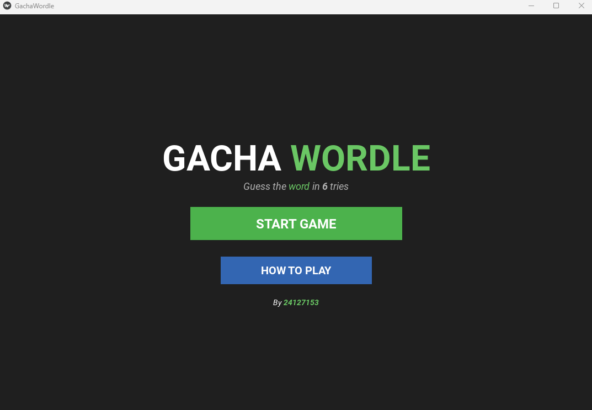
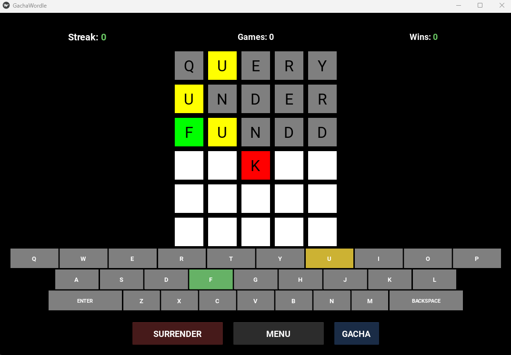
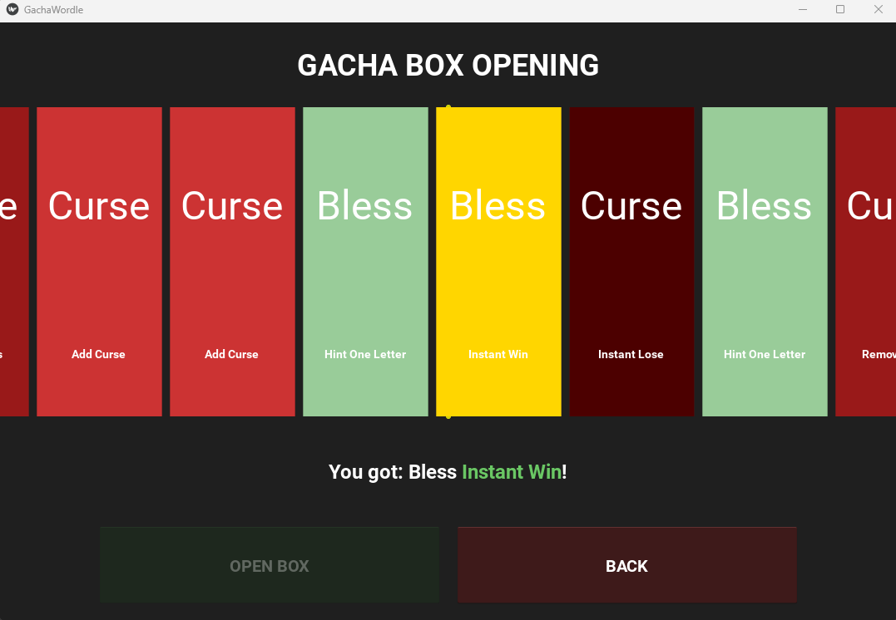

# Gacha Wordle

A desktop implementation of the popular Wordle game, but featuring a unique **Gacha System** that adds randomized power-ups and challenges to the classic gameplay!

## Features

- **Unlimited Plays** - Play as many games as you want
- **Statistics Tracking** - Track your wins, games played, and winning streak
- **Gacha System** - Roll for blessings and curses that affect gameplay
- **Modern UI** - Clean, polished interface with smooth slot machine-style animations

## How to Play



1. **Guess the word** - Type a 5-letter word using your keyboard and press Enter to submit your guess
2. **Check feedback**:
   - **Green** - Correct letter in correct position
   - **Yellow** - Correct letter in wrong position
   - **Gray** - Letter not in the word
3. **Use Gacha** - Press "ROLL DICE" to open a gacha box for random effects
4. **Win** - Guess the word within 6 tries

## Requirements

- Python 3.8+
- Kivy 2.3.1+
- See `pyproject.toml` for full dependency list

## Installation

1. Clone this repository:
```bash
git clone https://github.com/tothanhdat2006/wordle.git
cd wordle
```

2. Install dependencies using `uv`:
```bash
uv sync
```

3. Run the game:
```bash
python main.py
```

## Game Controls

- **A-Z Keys** - Type letters
- **Backspace** - Delete last letter
- **Enter** - Submit your guess
- **Surrender Button** - Give up and see the answer
- **Gacha Button** - Open gacha screen and enjoy!
- **Menu Button** - Return to main menu


## Gacha System


The Gacha system adds a unique twist to traditional Wordle gameplay. Players can press the "ROLL DICE" button to open a gacha box that will randomly grant either a **blessing** (helpful effect) or a **curse** (hindering effect).

### Gacha Items

The gacha system consists of 7 different items with varying probabilities:

#### Blessings (50% total)

- **Remove Curse (25%)** - Removes a cursed letter from the game board, unlocking a previously locked box
- **Add Tries (12%)** - Removes a row cursed by negative effects, giving you another chance
- **Hint One Letter (10%)** - Reveals an unrevealed letter from the hidden word at its correct position
- **Instant Win (3%)** - Automatically completes the game with a victory

#### Curses (50% total)

- **Add Curse (30%)** - Places a random letter in a future row and locks that box, preventing modification
- **Remove Tries (17%)** - Fills a random future row with random letters and locks them, reducing available attempts
- **Instant Lose (3%)** - Immediately ends the game with a loss

### Animation

The gacha features a slot machine-style animation:

1. **Fast Scroll Phase (2.5 seconds)** - Boxes scroll quickly using cubic easing
2. **Deceleration Phase (2.5 seconds)** - Scrolling gradually slows down using quadratic easing

The animation generates 50 boxes with randomly weighted items. The final result is determined by which box aligns closest to the center selector line, with randomized scroll distance (10-40 boxes) ensuring unpredictable outcomes.

### Technical Implementation

The gacha system is implemented across three main files:

- **`gacha.py`** - Contains the `Gacha` class with methods for each gacha effect
- **`gacha_animation.py`** - Manages the visual animation using Kivy's Animation class with colored backgrounds (green for blessings, red for curses)
- **`game_screen.py`** - Integrates gacha into gameplay through the `apply_gacha_result()` method

The system maintains balance by ensuring equal total probability (50%) for helpful and harmful effects, while making extreme outcomes (instant win/lose) equally rare at 3% each.
